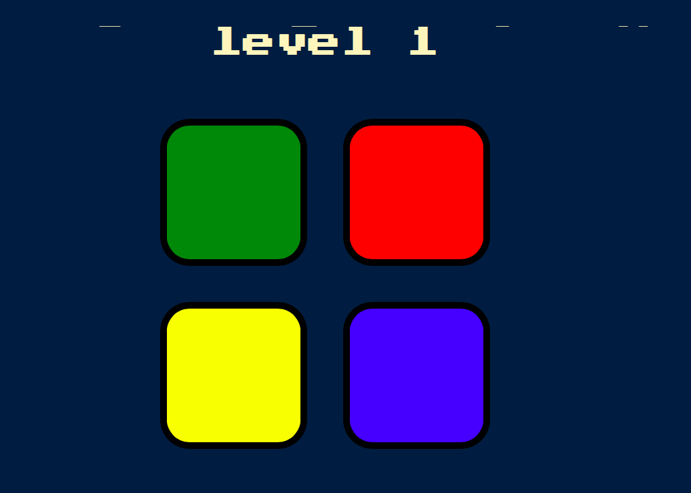

# **Simon Game**
## Game to improve memorization made in JS
### You can press any key to start and it Will show you a tile that you have to click on and, as yo go from level to level, the patterns get more and more complicated. At some Point you’re going to screw up and it’s going to tell you that you’ve got it wrong and game is over. You can Press any key to restart the game.

